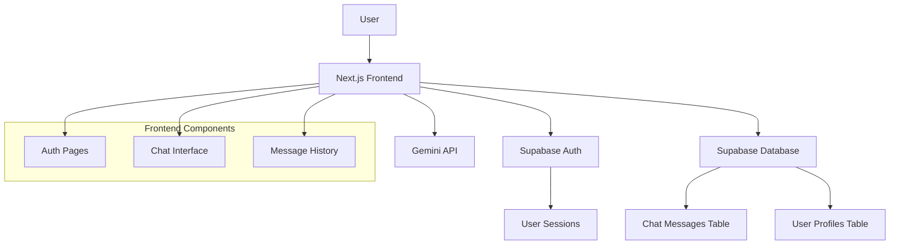
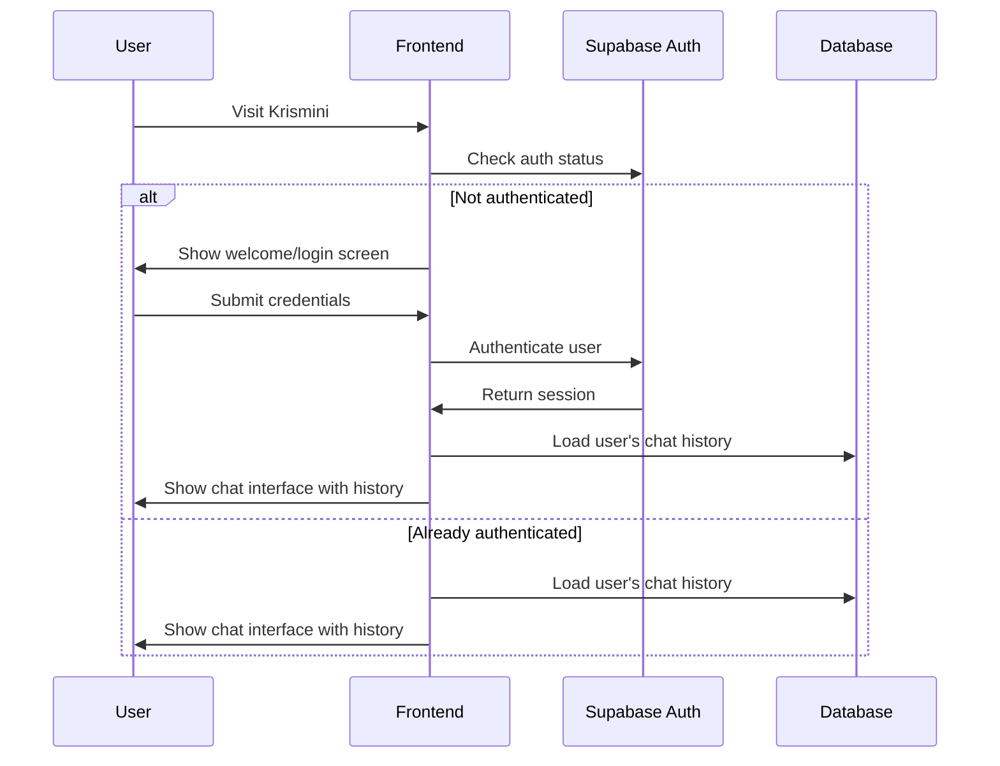

# Design Document

## Overview

This design implements user authentication and chat persistence for Krismini, transforming it from a session-based chat into a personalized AI companion that remembers every conversation. The solution leverages the existing Supabase infrastructure and extends the current chat interface with authentication flows and database persistence.

## Architecture

### High-Level Architecture



### Authentication Flow



## Components and Interfaces

### 1. Authentication Components

**AuthWrapper Component**
- Wraps the entire application
- Manages authentication state using Supabase Auth
- Redirects between auth and chat interfaces
- Handles session persistence

**LoginForm Component**
- Email/password login form
- Form validation and error handling
- Integration with Supabase Auth
- Loading states and user feedback

**SignUpForm Component**
- User registration form
- Email validation and password requirements
- Account creation flow
- Automatic login after successful registration

### 2. Database Schema

**users table** (extends Supabase auth.users)
```sql
CREATE TABLE public.profiles (
  id UUID REFERENCES auth.users(id) PRIMARY KEY,
  email TEXT NOT NULL,
  created_at TIMESTAMP WITH TIME ZONE DEFAULT NOW(),
  updated_at TIMESTAMP WITH TIME ZONE DEFAULT NOW()
);
```

**chat_messages table**
```sql
CREATE TABLE public.chat_messages (
  id UUID DEFAULT gen_random_uuid() PRIMARY KEY,
  user_id UUID REFERENCES auth.users(id) NOT NULL,
  role TEXT NOT NULL CHECK (role IN ('user', 'ai')),
  content TEXT NOT NULL,
  created_at TIMESTAMP WITH TIME ZONE DEFAULT NOW(),
  
  INDEX idx_chat_messages_user_created (user_id, created_at DESC)
);
```

### 3. Enhanced Chat Interface

**ChatContainer Component**
- Manages chat state and message history
- Handles real-time message saving
- Integrates with existing AI chat functionality
- Optimistic UI updates with database sync

**MessageHistory Component**
- Loads and displays conversation history
- Infinite scroll for large chat histories
- Message timestamps and formatting
- Maintains scroll position on new messages

## Data Models

### User Profile Model
```typescript
interface UserProfile {
  id: string;
  email: string;
  created_at: string;
  updated_at: string;
}
```

### Chat Message Model
```typescript
interface ChatMessage {
  id: string;
  user_id: string;
  role: 'user' | 'ai';
  content: string;
  created_at: string;
}
```

### Authentication State Model
```typescript
interface AuthState {
  user: User | null;
  loading: boolean;
  error: string | null;
}
```

## Error Handling

### Authentication Errors
- Invalid credentials: Clear error messages with retry options
- Network failures: Offline mode with sync when reconnected
- Session expiry: Automatic refresh or graceful re-authentication

### Database Errors
- Connection failures: Fallback to session-only chat with sync queue
- Save failures: Retry mechanism with exponential backoff
- Load failures: Graceful degradation with error notifications

### API Integration Errors
- Maintain existing Gemini API error handling
- Ensure chat continues to work even if persistence fails
- Queue messages for retry when database is unavailable

## Testing Strategy

### Unit Tests
- Authentication component logic
- Database query functions
- Message persistence utilities
- Form validation and error handling

### Integration Tests
- Complete authentication flow (signup → login → chat)
- Message saving and loading across sessions
- Error handling and recovery scenarios
- Session persistence and restoration

### End-to-End Tests
- User registration and first chat experience
- Returning user login and history restoration
- Cross-browser session management
- Mobile responsive authentication flows

## Security Considerations

### Authentication Security
- Use Supabase Auth's built-in security features
- Implement proper session management
- Secure password requirements and validation
- Protection against common auth vulnerabilities

### Data Privacy
- User messages are private and isolated by user_id
- Implement proper Row Level Security (RLS) policies
- Secure API endpoints with authentication checks
- No sharing of conversation data between users

### API Security
- Maintain existing Gemini API key security
- Implement rate limiting for authenticated users
- Validate all user inputs before database storage
- Sanitize message content for XSS prevention

## Performance Considerations

### Database Optimization
- Index on user_id and created_at for fast history queries
- Implement pagination for large conversation histories
- Consider archiving old messages for long-term users
- Optimize query patterns for real-time chat

### Frontend Performance
- Lazy load conversation history as needed
- Implement virtual scrolling for very long chats
- Cache recent messages in browser storage
- Optimize re-renders during real-time updates

### Scalability Planning
- Design database schema for horizontal scaling
- Consider message archiving strategies
- Plan for increased API usage with persistent users
- Monitor and optimize query performance